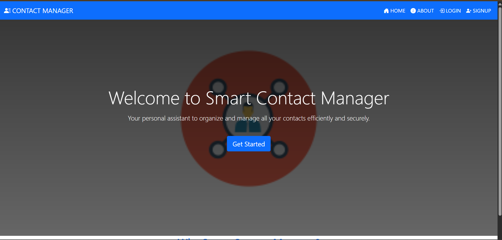
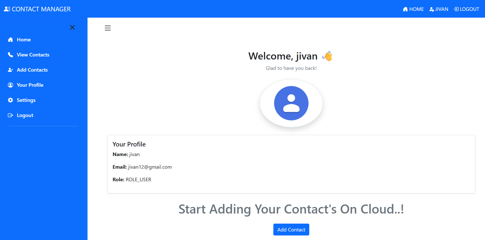
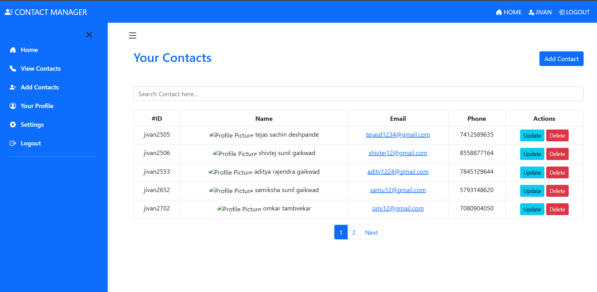
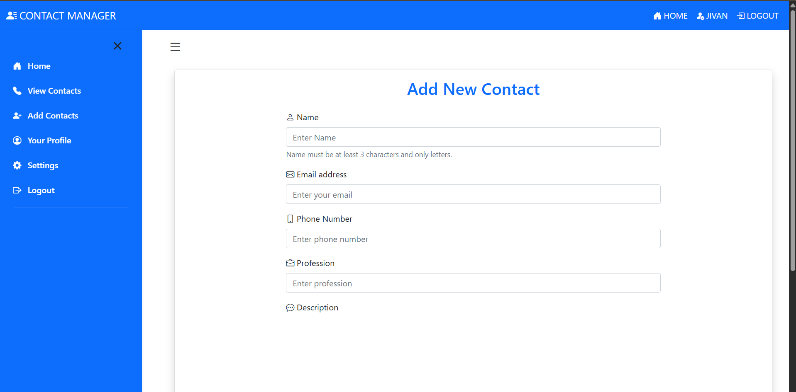

# 📇 Smart Contact Manager

A full-stack **Spring Boot** web application that helps users manage their personal contacts securely. This project includes user registration, login/logout, contact management (add, update, delete, view), and a user-friendly dashboard.



---

## ✨ Features

- 🔐 User Authentication (Sign Up & Login)
- 📇 Add, View, Update, and Delete Contacts
- 📁 Upload Contact Profile Images
- 🧑 Personalized User Dashboard
- 📜 Session Management and Error Handling
- 🧹 Spring Security Integration
- 🧩 Thymeleaf Templates
- 📊 Admin Panel (optional for future expansion)

---

## 🛠️ Tech Stack

- **Backend:** Spring Boot, Spring Security, Spring Data JPA
- **Frontend:** Thymeleaf, Bootstrap, HTML5, CSS3
- **Database:** MySQL
- **Build Tool:** Maven
- **IDE:** IntelliJ IDEA / VS Code / Eclipse

---

## 📷 Screenshots

### 🔐 Login Page


### 🏠 Dashboard


### 📇 Contact List


### ➕ Add Contact


---

## 🚀 Getting Started

### Prerequisites

- Java 17+
- Maven
- MySQL Server

### Setup

1. **Clone the Repository:**
   ```bash
   git clone https://github.com/ShivtejGaikwad29/SmartContact.git
   cd SmartContact
